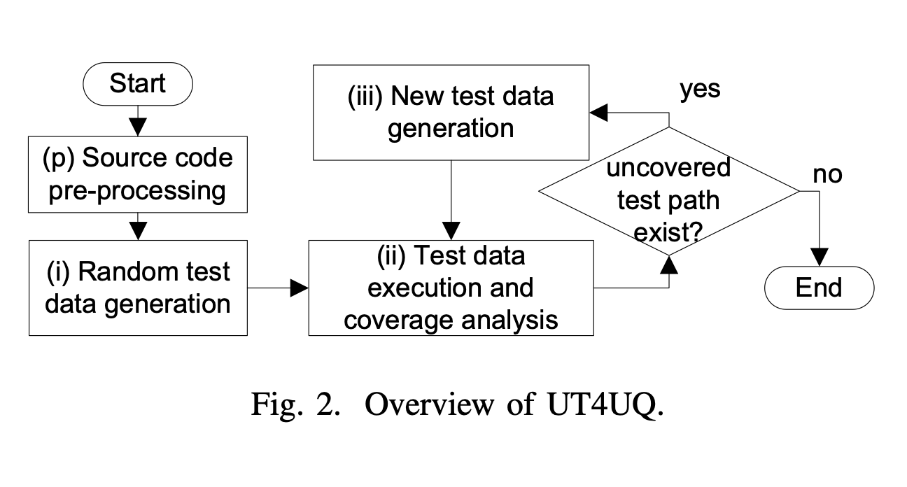

# UT4UQ — Automated Test Data Generation for Units using Qt Framework Classes in C++

> **An independent, unofficial re-implementation** of the paper
> **"A Method for Automated Test Data Generation for Units using Classes of Qt Framework in C++ Projects"**
> Thu Anh Bui, Lam Nguyen Tung, Hoang-Viet Tran, Pham Ngoc Hung — *2022 RIVF International Conference on Computing and Communication Technologies (RIVF)*, pp. 388–393.
> DOI: [10.1109/RIVF55975.2022.10013869](https://doi.org/10.1109/RIVF55975.2022.10013869)

> [!IMPORTANT]
> **Disclaimer — this is my own re-implementation, not the paper's original code.**
> I built this project **from scratch, by myself**, working from the *published description* of the paper above, and I am publishing it here for learning and reference.
> This repository is **not** the authors' original source code and **not** an official artifact of the paper. All credit for the *method* belongs to the original authors (cited below); any bugs, deviations, or misinterpretations in this code are entirely my own.

**UT4UQ** (*Unit Testing for Units using Qt*) automatically generates unit-test data for C++ functions whose parameters are **Qt Framework classes** — a case classic concolic-testing tools cannot handle, because they do not know how to instantiate a library class inside a test driver.

This is my attempt to reproduce that method independently: I re-derived the pipeline from the paper and implemented it in Java/C++ so the approach can be studied, run, and built upon. Where the paper leaves details unspecified, the concrete design choices here are mine.

The key idea is a **source-code pre-processing phase** added in front of standard concolic testing: the Qt Framework source is included into the project under test, parsed into an AST with [Eclipse CDT](https://www.eclipse.org/cdt/), and each Qt class parameter's **list of constructors** is recovered. Those constructors are then used to instantiate the parameter objects when synthesizing the test driver, so the generated test data can actually be compiled and executed to measure coverage.

---

## Table of contents

- [Method overview](#method-overview)
- [How the code maps to the paper](#how-the-code-maps-to-the-paper)
- [Repository layout](#repository-layout)
- [Requirements](#requirements)
- [Build](#build)
- [Development setup (IntelliJ IDEA + Smart Tomcat)](#development-setup-intellij-idea--smart-tomcat)
- [Running the tool](#running-the-tool)
- [Configuration](#configuration)
- [Reproducing the paper experiments](#reproducing-the-paper-experiments)
- [Results](#results)
- [Limitations](#limitations)
- [Citation](#citation)
- [Acknowledgements](#acknowledgements)

---

## Method overview

UT4UQ extends concolic testing (a combination of concrete + symbolic execution, à la DART/CUTE) with one extra phase **(p)**:

<p align="center">
  <br>
  <em>Figure reproduced from the original paper (Bui et al., RIVF 2022).</em>
</p>

- **(p) Source-code pre-processing** — recursively resolve `#include` directives with a `Q…` prefix to collect the needed Qt headers (Algorithm 1), build the AST via Eclipse CDT, and extract each Qt class's constructor list (Algorithm 2).
- **(i) Random test-data generation** — for each parameter of the unit under test: if it is a Qt class, instantiate it by invoking a randomly selected constructor; otherwise generate a random primitive value (Algorithm 3).
- **(ii) Test-data execution & coverage analysis** — generate a **test driver** (setup / call / teardown), instrument and compile it, run the executable, collect executed lines, compute statement coverage (C1), and look for an uncovered test path (Algorithm 4).
- **(iii) New test-data generation** — symbolically execute the uncovered path to obtain a path constraint, solve it, and derive the next test data (Algorithm 5). Loop until coverage stops increasing / no uncovered path remains.

## How the code maps to the paper

Because I implemented this from the paper alone (no access to the authors' code), the mapping below is my own reading of how each algorithm in the paper corresponds to code in this repository. The generation engine lives in the [`aut/`](aut) module (`uet.fit.aut`). The most relevant classes:

| Paper concept | Code |
| --- | --- |
| Algorithm 1 — find needed Qt header files | [`parser/dependency/IncludeQtHeaderPreprocessor.java`](aut/src/main/java/uet/fit/aut/parser/dependency/IncludeQtHeaderPreprocessor.java), [`parser/qt/QTFileUtils.java`](aut/src/main/java/uet/fit/aut/parser/qt/QTFileUtils.java) |
| Phase (p) — parse Qt source → AST | [`parser/qt/QTParser.java`](aut/src/main/java/uet/fit/aut/parser/qt/QTParser.java), [`parser/QtPrimitiveTypedefResolver.java`](aut/src/main/java/uet/fit/aut/parser/QtPrimitiveTypedefResolver.java), [`parser/obj/QtHeaderNode.java`](aut/src/main/java/uet/fit/aut/parser/obj/QtHeaderNode.java) |
| Algorithm 2 — retrieve constructors | [`search/condition/ConstructorNodeCondition.java`](aut/src/main/java/uet/fit/aut/search/condition/ConstructorNodeCondition.java), [`search/condition/ClassNodeCondition.java`](aut/src/main/java/uet/fit/aut/search/condition/ClassNodeCondition.java) |
| Algorithm 3 — random test data | [`autogen/testdatagen/RandomAutomatedTestdataGeneration.java`](aut/src/main/java/uet/fit/aut/autogen/testdatagen/RandomAutomatedTestdataGeneration.java), [`boundary/`](aut/src/main/java/uet/fit/aut/boundary) |
| Test-driver synthesis (C++ / Qt) | [`execution/testdriver/TestDriverGenerationForCpp.java`](aut/src/main/java/uet/fit/aut/execution/testdriver/TestDriverGenerationForCpp.java) |
| Algorithm 4 — execute & compute coverage | [`execution/TestcaseExecution.java`](aut/src/main/java/uet/fit/aut/execution/TestcaseExecution.java), [`instrument/`](aut/src/main/java/uet/fit/aut/instrument), [`coverage/`](aut/src/main/java/uet/fit/aut/coverage) |
| Algorithm 5 — symbolic / concolic new data | [`autogen/testdatagen/SymbolicExecutionTestdataGeneration.java`](aut/src/main/java/uet/fit/aut/autogen/testdatagen/SymbolicExecutionTestdataGeneration.java), [`autogen/testdatagen/ConcolicAutomatedTestdataGeneration.java`](aut/src/main/java/uet/fit/aut/autogen/testdatagen/ConcolicAutomatedTestdataGeneration.java), [`autogen/cfg/`](aut/src/main/java/uet/fit/aut/autogen/cfg) |
| **CFDS** baseline used in the comparison | [`autogen/testdatagen/CFDSAutomatedTestdataGeneration.java`](aut/src/main/java/uet/fit/aut/autogen/testdatagen/CFDSAutomatedTestdataGeneration.java) |

> Several generation strategies (`Random`, `CFDS`, `DFS`, `Directed`, `BasisPath`, `Concolic`, `SymbolicExecution`) share the `IAutomatedTestdataGeneration` interface, so UT4UQ and its baseline can be swapped for like-for-like comparison.

## Repository layout

This is a Maven multi-module project. UT4UQ is exposed through a **server** (REST backend) and a **desktop client** (JavaFX GUI):

```
config   Global configuration singleton (toolchain paths, DB, timeouts)
common   Shared DTOs / utilities / data models
aut      ← UT4UQ generation engine (parser, pre-processing, concolic, driver, coverage)
cia      Change-impact analysis over C/C++ (cia-api + cia-display)
report   Coverage / test-generation report builder
server   REST backend (RESTEasy on Tomcat 9) that drives the aut engine  → .war
client   JavaFX GUI that talks to the server over HTTP                    → fat .jar
docker   Self-contained image: MariaDB + Qt 5.14.2 + Tomcat 9
```

## Requirements

The tool compiles, instruments and runs real C++ code, so it needs a native toolchain in addition to the JVM:

- **JDK 11 or newer** and **Maven ≥ 3.2.5** — the reference environment uses **Oracle JDK 17** (the project still compiles to Java 11 bytecode).
- **g++**, **make** — C++ compiler and build tool
- **Qt Platform 5.14.2** with **qmake** (matching the projects under test)
- **MySQL / MariaDB** (test cases, users and environments are persisted via MyBatis)
- **Apache Tomcat 9** (reference: **9.0.60**) as the servlet container for the server module
- **[Multicia](https://drive.google.com/file/d/1nmTTJ9X2NrywhC3mxJ51ZemojxOgDh1s/view)** package — native support package required by the analysis engine
- The bundled **Eclipse CDT** artifact in [`lib/`](lib) — installed into your local Maven repo automatically on first build (see the root [`pom.xml`](pom.xml)); a clean build depends on those jars being present.

Reference OS: **Linux kernel 4.15, 64-bit**. The provided [`docker/Dockerfile`](docker/Dockerfile) packages the whole stack (MariaDB + Qt + Tomcat) into one image and is the easiest way to get a reproducible environment.

## Build

```bash
mvn clean package
```

> Build output is redirected to `build/` (not `target/`). The server `.war` is produced under the `server` module's build directory; the client fat jar is `client/build/target-client-1.0-SNAPSHOT/client-1.0-SNAPSHOT-fat.jar` (main class `uet.fit.client.ui.Main`).

Build a single module (and only its dependencies):

```bash
mvn -pl aut -am package        # engine only
mvn -pl server -am package     # backend .war
```

## Development setup (IntelliJ IDEA + Smart Tomcat)

The reference development environment runs the **server** in IntelliJ IDEA via the *Smart Tomcat* plugin and the **client** as a plain application run configuration.

### Prerequisites

- Linux Kernel 4.15 — 64bit
- [IntelliJ IDEA](https://www.jetbrains.com/idea/) (with the *Smart Tomcat* plugin)
- [Oracle JDK 17](https://www.oracle.com/java/technologies/javase/jdk17-archive-downloads.html)
- MySQL
- [Qt Platform 5.14.2](https://download.qt.io/archive/qt/5.14/5.14.2/)
- [Multicia package](https://drive.google.com/file/d/1nmTTJ9X2NrywhC3mxJ51ZemojxOgDh1s/view)
- Tomcat 9.0.60

### Setup

1. Clone this repository.
2. Open this project in IntelliJ IDEA.
3. Configure the server with **Smart Tomcat**:
   1. Context Path: `/`
   2. Server Port: `8081`
   3. Admin Port: `8005`
   4. Edit configurations at `http://localhost:8081/config`: **qmake path**, **CIAUT Home**, **Database User**.
   5. Edit Users Administration at `http://localhost:8081/user/admin` (applies only on the first run): add a username and password.
4. Configure the client:
   1. Add an *Application* run configuration for the class [`Main.java`](client/src/main/java/uet/fit/client/ui/Main.java) (`uet.fit.client.ui.Main`).
   2. Add CLI arguments to the application: `-server=http://localhost:8081`.

> The client accepts the server URL from the `-server=<url>` CLI argument (as above), from a saved config file, or from an interactive prompt — see `AppStart` in the `client` module.

## Running the tool

**Option A — Docker (recommended).** Build the image from `docker/`, run it (exposes `8080` and a `/data` volume), then drop the freshly built `server.war` into `/data/server.war`; the entrypoint hot-deploys it and auto-generates `/data/config.properties` on first start.

**Option B — manual.** Deploy `server.war` to Tomcat 9 with the `CIAUT_CONFIG` environment variable pointing at your `config.properties`, start a MariaDB instance matching that config, then launch the client:

```bash
java -jar client/build/target-client-1.0-SNAPSHOT/client-1.0-SNAPSHOT-fat.jar http://localhost:8080
```

Typical workflow in the GUI: register/clone a C++ (Qt) project → pick a source file and a **function under test** → run generation → inspect the generated test data, the synthesized test driver, and the achieved statement coverage. Under the hood the client calls the server's REST API (`/repo`, `/func/gen`, `/func/viewCoverage`, `/test`, …).

## Configuration

Runtime configuration is a single properties file resolved from `CIAUT_CONFIG` (system property or env var). Keys that matter for UT4UQ:

| Key | Meaning |
| --- | --- |
| `GPP_PATH` | path to `g++` |
| `QMAKE_PATH` | path to `qmake` (Qt) |
| `MAKE_PATH` | path to `make` |
| `MAKE_JOBS_COUNT` | parallel build jobs |
| `RUN_TEST_TIMEOUT` | per-test execution timeout |
| `FUNCTION_CALL_ANALYZE` | enable function-call analysis |
| `CIAUT_HOME`, `TOMCAT_LOG` | working / log directories |
| `SQL_HOST`, `SQL_PORT`, `SQL_USER`, `SQL_PASSWORD` | database connection |

## Reproducing the paper experiments

The paper evaluates UT4UQ against the **CFDS** concolic baseline on three open-source Qt projects, using **statement coverage (C0)**:

| Subject | Source |
| --- | --- |
| **QtQuickExample** | https://github.com/toby20130333/QtQuickExample |
| **Qt360** | https://github.com/jun-zhang/Qt360 |
| **StringSearch** | https://github.com/ShSamariddin/StringSearch |

To reproduce: clone a subject through the tool, generate test data once with the `CFDS` strategy and once with UT4UQ (Qt pre-processing enabled), and compare per-file coverage, number of generated test data, time, and memory. The original hardware was an Intel Core i5-3330S (4 cores), 8 GB RAM, Ubuntu 18.04.6 LTS.

## Limitations

Directly from the paper's future work, these Qt/C++ constructs are not (fully) handled yet:

- template classes and recursively-constructed classes;
- other complex aggregates such as `struct` / `union` parameters;
- initializing Qt class **attributes** when solving constraints that contain a Qt instance.

## Citation

```bibtex
@INPROCEEDINGS{10013869,
  author={Bui, Thu Anh and Tung, Lam Nguyen and Tran, Hoang-Viet and Hung, Pham Ngoc},
  booktitle={2022 RIVF International Conference on Computing and Communication Technologies (RIVF)}, 
  title={A Method for Automated Test Data Generation for Units using Classes of Qt Framework in C++ Projects}, 
  year={2022},
  volume={},
  number={},
  pages={388-393},
  keywords={Computer languages;Source coding;Instruments;C++ languages;Libraries;Communications technology;Usability;Test data generation;Qt Framework;C++ unit test},
  doi={10.1109/RIVF55975.2022.10013869}}
```

## Acknowledgements

The **method** re-implemented here is entirely the work of the original authors — Thu Anh Bui, Lam Nguyen Tung, Hoang-Viet Tran, and Pham Ngoc Hung — originally developed at the **VNU University of Engineering and Technology (UET-FIT)**, Hanoi, Vietnam. From their paper: *Lam Nguyen Tung was funded by Vingroup JSC and supported by the Master, PhD Scholarship Programme of Vingroup Innovation Foundation (VINIF), Institute of Big Data, code* **VINIF.2021.ThS.25**.

This repository is my own **independent re-implementation** ([@datntrong](https://github.com/datntrong)), created for study purposes — a personal reproduction of the method, not the official code released with the paper.
